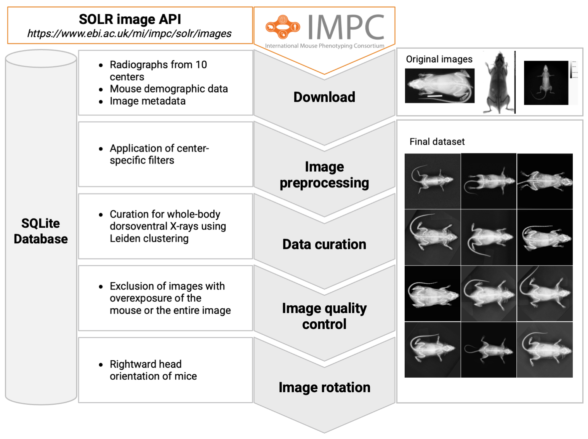

# FERDINAND

An open framework for access and AI-ready preprocessing of IMPC 2D radiographs.



## Purpose

FERDINAND is an end-to-end workflow for building AI-ready datasets from IMPC 2D radiographs. It covers metadata retrieval, image download, preprocessing, curation, quality checks, and rotation/alignment.

Core components:

- `notebooks/100_fetch_data_from_impc.ipynb`
- `notebooks/200_download_impc_images.ipynb`
- `notebooks/300_preprocess_dataset.ipynb`
- `notebooks/310_curate_dataset.ipynb`
- `notebooks/320_check_image_quality.ipynb`
- `notebooks/400_rotate_images.ipynb`
- `src/ferdinand/` for the underlying Python modules

## Prerequisites

### Docker path

- Docker Desktop on macOS/Windows, or Docker Engine on Linux
- Docker Compose v2 (`docker compose`)

### Local Python path

- Python 3.10 or newer
- `pip`
- a virtual environment (`venv` or conda)

## Clone Repository

```bash
git clone https://github.com/ExperimentalGenetics/FERDINAnD.git
cd FERDINAnD
```

## Choose How To Run FERDINAND

You can run FERDINAND in two supported ways:

- Docker-based workflow
- Local Python environment

For most users, Docker is the recommended path.

## Quick Start With Docker

Recommended for most users.

1. Create `config/config.yml` from `config/config.example.yml`.
2. Review at least these settings:
   - `run_name`
   - `project_root`
   - `data_dir`, `models_dir`, `reports_dir`
   - `angle_detection_model`
   - `docker_group_id`
   - `jupyter_host`
3. Make sure these directories exist:
   - `data`
   - `models`
   - `reports`
4. Start the stack:
   - Without Traefik:
   ```bash
   ./docker/compose.sh up -d --build
   ```
   - With Traefik:
   ```bash
   ./docker/compose.sh --traefik up -d --build
   ```
5. Open JupyterLab:
   - Without Traefik: `http://localhost:8888`
   - With Traefik: `https://<jupyter_host>/lab`
6. Run the notebooks in order:
   - `notebooks/100_fetch_data_from_impc.ipynb`
   - `notebooks/200_download_impc_images.ipynb`
   - `notebooks/300_preprocess_dataset.ipynb`
   - `notebooks/310_curate_dataset.ipynb`
   - `notebooks/320_check_image_quality.ipynb`
   - `notebooks/400_rotate_images.ipynb`

## Docker Notes

- Start: `./docker/compose.sh up -d --build`
- Logs: `./docker/compose.sh logs -f`
- Shell: `./docker/compose.sh exec ferdinand bash`
- Stop: `./docker/compose.sh down`

The compose helper script generates `docker/.env.compose` from `config/config.yml` via:

```bash
./docker/generate_compose_env.py
```

It currently derives:

- `data_dir`
- `models_dir`
- `reports_dir`
- `docker_group_id`
- `jupyter_host`
- `jupyter_port`

Note: the current Docker Compose port mapping is fixed to `8888:8888`, so browser access without Traefik is still `http://localhost:8888`.

## Local Installation

1. Create and activate a virtual environment:

   ```bash
   python3 -m venv .venv
   source .venv/bin/activate
   ```

2. Upgrade `pip`:

   ```bash
   pip install --upgrade pip
   ```

3. Make sure `requirements.txt` points to the requirements file for your platform if you want to switch architecture-specific dependencies.

4. Install the package:

   ```bash
   pip install setuptools
   pip install -e .
   ```

To deactivate the environment:

```bash
deactivate
```

## Project Structure

- `src/ferdinand/` core Python modules
- `notebooks/` pipeline notebooks
- `config/` YAML configuration
- `docker/` Docker and Compose setup
- `data/` dataset storage
- `models/` model files
- `reports/` generated reports and outputs

## Troubleshooting

### `img_to_array` ImportError

Depending on the TensorFlow/Keras version, `img_to_array` may come from different modules. If needed, use a compatibility import in `src/ferdinand/image_utils.py`:

```python
try:
    from tensorflow.keras.utils import img_to_array
except ImportError:
    from tensorflow.keras.preprocessing.image import img_to_array
```
